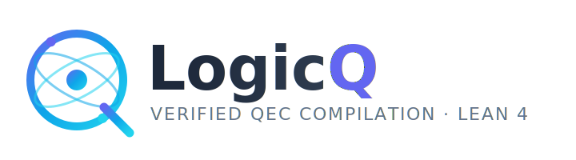
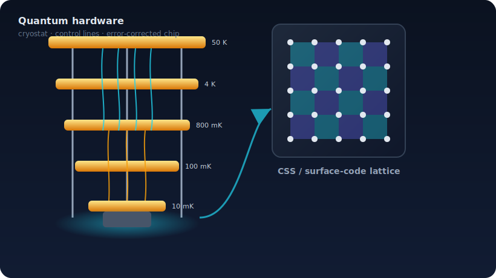
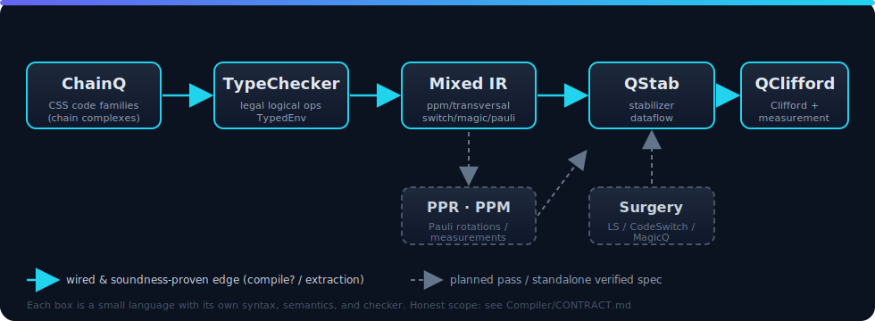

<p align="center">
  
</p>

<p align="center">
  <b>A &ldquo;quantum CompCert&rdquo;: a Lean&nbsp;4 verified compiler from chain-complex&ndash;typed fault-tolerant programs down to a physical Clifford&nbsp;+&nbsp;measurement target.</b>
</p>

<p align="center">
  
  
  
  
  
</p>

---

LogicQ is a Lean&nbsp;4 workspace for a verified quantum-error-correction (QEC) compilation stack.
The code is organized as a tower of **small languages**, each with its own syntax,
semantics, and checker, connected by lowering passes whose soundness theorems are
kernel-checked.

<p align="center">
  
</p>

Quantum error correction protects a handful of *logical* qubits by spreading them across
many noisy *physical* qubits on a chip cooled inside a dilution refrigerator (above).
Turning a high-level fault-tolerant program into the exact sequence of physical Clifford
gates and stabilizer measurements such a machine must run is a long, error-prone
compilation. LogicQ makes **every stage of that translation a typed, checked artifact** —
and, for the wired passes, *proves* that lowering preserves the intended logical action.

## The stack

<p align="center">
  
</p>

The currently **wired** compiler path is:

```text
ChainQ code families  →  TypeChecker.TypedEnv  →  Compiler LogicalOp  →  Mixed IR
```

plus the physical extraction edges `Mixed / PPM  →  QStab  →  QClifford`.

The longer **target** stack — some stages exist today as standalone verified language
specs, with the passes between them planned — is:

```text
ChainQ  →  PPR  →  PPM  →  surgery / adapter  →  QStab  →  QClifford
```

Each box above is a small language with its own syntax, semantics, and checker.
Solid arrows are wired edges with soundness theorems; dashed arrows are planned passes
or standalone specs.

> **Honest scope.** LogicQ is careful to separate what is *proved* from what is *assumed*
> or *planned*. Soundness theorems are `propext`-clean (**not** advertised as
> &ldquo;axiom-free&rdquo;). Static legality, addressing, and resource discipline are proved;
> physical **channel correctness, code distance, decoders, and fault tolerance are explicit
> deferred obligations** — never silently assumed. The full tier-by-tier contract is in
> **[Compiler/CONTRACT.md](Compiler/CONTRACT.md)**; the design rationale is in
> **[DESIGN.md](DESIGN.md)**.

## End-to-end LOC by layer

Here **LOC** means executable IR line count: one QASM instruction, one generated
ChainQ/LogicQ primitive, one MixedIR step, one QStab stabilizer instruction, or one final
QClifford gate. Declarations, comments, and barriers are excluded. The table splits QStab
into the resident-code syndrome pass and the logical-operation fragment, then shows their
total. The numbers below are checked in
[Compiler/QASM/Benchmarks.lean](Compiler/QASM/Benchmarks.lean) by `#guard` tests, using
the currently wired structural physical path.

The main scaling signal comes from nontrivial code blocks. Bare `d=1` rows are only smoke
tests: they map one logical qubit to one physical qubit, so equal counts across layers are
expected and do **not** demonstrate physical expansion.

| Example | Setup | QASM | LogicQ | MixedIR | Syn QStab | Logical QStab | Total QStab | QClifford | Width |
|---|---:|---:|---:|---:|---:|---:|---:|---:|---:|
| `X; measure Z` | raw CSS `xCheck2` | 2 | 2 | 2 | 1 | 2 | 3 | 10 | 4 |
| `X; measure Z` | surface d=2 | 2 | 2 | 2 | 4 | 3 | 7 | 28 | 10 |
| `X; measure Z` | surface d=3 | 2 | 2 | 2 | 12 | 4 | 16 | 78 | 26 |
| `X; measure Z` | surface d=4 | 2 | 2 | 2 | 24 | 5 | 29 | 154 | 50 |
| `X/Z; measure Z/Z` | toric d=2 | 4 | 4 | 4 | 8 | 6 | 14 | 64 | 18 |
| `X/Z; measure Z/Z` | toric d=3 | 4 | 4 | 4 | 18 | 8 | 26 | 133 | 38 |
| `X; measure Z` | HGP `[[8,1]]` | 2 | 2 | 2 | 7 | 3 | 10 | 47 | 16 |
| `X/Z; measure Z/Z` | lifted product `[[15,3]]` | 4 | 4 | 4 | 12 | 6 | 18 | 78 | 29 |
| `X/Z; measure Z/Z` | toy LP `[[15,2]]` | 4 | 4 | 4 | 6 | 6 | 12 | 52 | 14 |
| `X/Z; measure Z/Z` | BB `[[18,4]]` | 4 | 4 | 4 | 18 | 14 | 32 | 181 | 38 |
| `cx q[0],q[1]` | surface d=2 | 1 | 1 | 1 | 8 | 5 | 13 | 49 | 18 |
| `cx q[0],q[1]` | surface d=3 | 1 | 1 | 1 | 24 | 13 | 37 | 153 | 50 |
| `cx q[0],q[1]` | surface d=4 | 1 | 1 | 1 | 48 | 25 | 73 | 313 | 98 |
| 3-CX chain | surface d=2, 4 blocks | 3 | 3 | 3 | 16 | 15 | 31 | 103 | 36 |
| 3-CX chain | surface d=3, 4 blocks | 3 | 3 | 3 | 48 | 39 | 87 | 319 | 100 |
| 3-CX chain | surface d=4, 4 blocks | 3 | 3 | 3 | 96 | 75 | 171 | 651 | 196 |
| `cat_state_n4` | bare d=1 sanity | 8 | 8 | 8 | 0 | 8 | 8 | 8 | 4 |
| `ghz_n78` | bare d=1 sanity | 156 | 156 | 156 | 0 | 156 | 156 | 156 | 78 |

The larger QASMBench rows below are encoded into actual Steane `[[7,1,3]]` CSS code
blocks, one code block per QASM virtual qubit. The compiler checks the Steane code and
logical basis, performs logical-qubit allocation, lowers H/CX/X/Z/measurement through the
encoded pipeline, prepends one stabilizer-extraction pass for every resident code block,
and extracts the resulting QStab program to QClifford. The two positive-suite programs
containing T gates (`teleportation_n3`, `qec_en_n5`) are checked negatives until magic-state
injection is wired into the physical path.

| QASMBench source | Encoded setup | QASM | LogicQ | MixedIR | Syn QStab | Logical QStab | Total QStab | QClifford | Width |
|---|---:|---:|---:|---:|---:|---:|---:|---:|---:|
| `qrng_n4` | Steane x4 | 8 | 8 | 8 | 24 | 32 | 56 | 220 | 56 |
| `deutsch_n2` | Steane x2 | 7 | 7 | 7 | 12 | 37 | 49 | 131 | 28 |
| `iswap_n2` | Steane x2 | 11 | 11 | 11 | 12 | 65 | 77 | 159 | 28 |
| `cat_state_n4` | Steane x4 | 8 | 8 | 8 | 24 | 32 | 56 | 220 | 56 |
| `grover_n2` | Steane x2 | 18 | 18 | 18 | 12 | 114 | 126 | 208 | 28 |
| `lpn_n5` | Steane x5 | 16 | 16 | 16 | 30 | 82 | 112 | 317 | 70 |
| `hs4_n4` | Steane x4 | 32 | 32 | 32 | 24 | 200 | 224 | 388 | 56 |
| `bb84_n8` | Steane x8 | 43 | 43 | 43 | 48 | 205 | 253 | 645 | 120 |
| `qec9xz_n17` | Steane x17 | 61 | 61 | 61 | 102 | 379 | 481 | 1106 | 229 |
| `cat_state_n22` | Steane x22 | 44 | 44 | 44 | 132 | 176 | 308 | 1210 | 308 |
| `ghz_state_n23` | Steane x23 | 46 | 46 | 46 | 138 | 184 | 322 | 1265 | 322 |
| `bv_n14` | Steane x14 | 54 | 54 | 54 | 84 | 300 | 384 | 950 | 195 |
| `bv_n19` | Steane x19 | 74 | 74 | 74 | 114 | 410 | 524 | 1295 | 265 |
| `cat_n35` | Steane x35 | 70 | 70 | 70 | 210 | 280 | 490 | 1925 | 490 |
| `ghz_n40` | Steane x40 | 80 | 80 | 80 | 240 | 320 | 560 | 2200 | 560 |
| `bv_n30` | Steane x30 | 107 | 107 | 107 | 180 | 575 | 755 | 1977 | 419 |
| `cat_n65` | Steane x65 | 130 | 130 | 130 | 390 | 520 | 910 | 3575 | 910 |
| `ghz_n78` | Steane x78 | 156 | 156 | 156 | 468 | 624 | 1092 | 4290 | 1092 |

Additional encoded family sweeps are checked in the same file. These are not hand-counted
tables; each row is a `#guard` that runs the actual QASM/LogicQ/MixedIR/QStab/QClifford
pipeline:

| Family | Checked encoded setup | Positive path | Checked blockers |
|---|---|---|---|
| raw CSS | `xCheck2`, Steane `[[7,1,3]]` | readout and QASMBench no-magic subset | T/magic QASMBench cases |
| surface | distances `d = 2,3,4,5` | readout, one CX, 3-CX chain | invalid `d = 0,1`; H remains unsupported |
| toric | distances `d = 2,3,4,5` | two-logical readout | invalid `d = 0,1`; naive identity-incidence CX |
| HGP | open-grid `(2,2)`, `(3,2)`, `(3,3)`, `(4,3)` | encoded readout | malformed declarations via ChainQ checks |
| lifted product | `ell = 2,3,4,5` for the line-protograph fixture | two-logical readout | malformed declarations via ChainQ checks |
| BB | demo `[[8,2]]` plus dimension-jump `[[18,2]]`, `[[30,2]]`, `[[54,2]]` | two-logical readout | zero-logical BB variants reject allocation |

Direct MixedIR fixtures are also checked. `QASM = 0` and `LogicQ = 0` mean the input
starts at MixedIR, not that earlier layers compiled away:

| Example | Setup | QASM | LogicQ | MixedIR | Syn QStab | Logical QStab | Total QStab | QClifford | Width |
|---|---:|---:|---:|---:|---:|---:|---:|---:|---:|
| H; S; X; CNOT; two PPMs | two bare blocks | 0 | 0 | 6 | 0 | 6 | 6 | 7 | 2 |
| batched CNOT; two Paulis; two PPMs | two bare blocks | 0 | 0 | 5 | 0 | 5 | 5 | 5 | 2 |

The current physical path includes exactly one stabilizer-extraction pass. It does not include
repeated syndrome rounds, decoder logic, fault-tolerance padding, or T-gate magic injection;
those remain explicit downstream obligations. A naive identity-incidence logical CX on
separated toric blocks is also a checked negative today: the compiler cannot prove that
incidence realizes the requested logical CNOT for that toric logical basis.

## Layers at a glance

| Folder | Layer | What lives there |
|---|---|---|
| [Logical](Logical/README.md) | vocabulary | logical block ids and the `LQubit` address scheme shared by every IR |
| [Physical](Physical/README.md) | vocabulary | physical qubit addresses and the dense 4-letter Pauli alphabet |
| [ChainQ](ChainQ/README.md) | `L_FE` front-end | CSS / stabilizer code families, type-checked into proof-carrying `CheckedCSSCode` |
| [TypeChecker](TypeChecker/README.md) | legality | accepts a logical op only when a finite GF(2)/symplectic certificate recomputes |
| [Compiler](Compiler/README.md) | lowering | `Source LogicalOp → Mixed IR` (`compile?`) + bridges toward QStab/QClifford |
| [PPR](PPR/README.md) | `L_PPR` spec | logical Pauli-product rotations `exp(i φ P)` with a Mathlib denotation |
| [PPM](PPM/README.md) | `L_PPM` spec | adaptive Pauli-product measurement programs (QMeas) |
| [MagicQ](MagicQ/README.md) | magic states | cultivation + Bravyi–Kitaev 15-to-1 distillation protocol checker |
| [QStab](QStab/README.md) | `L_QStab` target | physical stabilizer-measurement classical dataflow |
| [QClifford](QClifford/README.md) | `L_QClifford` target | physical Clifford gates + measurement circuits |
| [CodeSwitching](CodeSwitching/README.md) | reserved | source-level switching stub (real legality in TypeChecker/Judgment/Switch + Compiler/CodeSwitch) |
| [LatticeSurgery](LatticeSurgery/README.md) | reserved | surgery-language stub (real surgery IR lives in [Compiler/LS](Compiler/LS/README.md)) |
| [Library](Library/README.md) | references | vendored arXiv sources and notes (source-only; gitignored) |

**Inside the compiler** ([Compiler/README.md](Compiler/README.md)): the
[Mixed IR](Compiler/Mixed/README.md) target and [its lowering](Compiler/Mixed/Lower/README.md);
the verified [ChainQ2Mixed](Compiler/ChainQ2Mixed/README.md) front-end (path + schedule +
QGPU/qLDPC); the [QStab2QClifford](Compiler/QStab2QClifford/README.md) syndrome-extraction
pass; the [OpenQASM-2 front-end](Compiler/QASM/README.md) and the
[`.lqr` surface front-end](Compiler/Surface/README.md); the
[lattice-surgery IR](Compiler/LS/README.md); the
[code-switch certificates](Compiler/CodeSwitch/README.md); the
[state-vector Simulator](Compiler/Simulator/README.md); and the worked
[Demo](Compiler/Demo/README.md) programs.

## One program at every level — in the project's BNF surface syntax

Every IR level defines its concrete syntax as a **BNF grammar** in its `Syntax.lean`, and **every
level now has a real, total text parser** (`Parsing/Basic.lean` + each layer's `Parse.lean`), with
`by decide` round-trip tests. **Two keyword rules run through the surface syntax — the keywords ARE
the AST constructors:** every **logical** instruction carries the **`Logical`** keyword, and every
**Mixed IR** instruction **leads with its kind keyword** (`transversal`, `transversalCNOT`, `pauli`,
`ppm`, `magic`, `switch`, …). Below is one minimal program — **flip a qubit, then read it out** — at
each level.

**Logical program** — every instruction carries the **`Logical`** keyword (`LogicalOp`; parses today
— [Compiler/Mixed/Parse.lean](Compiler/Mixed/Parse.lean)):

```rust
Logical X q[0]                  // logical bit-flip on logical qubit 0
Logical measure q[0]↦Z -> c0    // logical Z-readout into classical bit c0
```

**Mixed IR** — each instruction **leads with its kind keyword** (`MixedInstr`; parses today —
[Compiler/Mixed/Parse.lean](Compiler/Mixed/Parse.lean)):

```rust
pauli X q[0]                    // the X lowers to a logical Pauli applied to the carrier
ppm c0 := M q[0]↦Z              // the measurement lowers to a native PPM fragment
```

**QASM-compatible front-ends.** The same circuit is also accepted as *bare-gate* text by the `.lqr`
front-end ([Compiler/Surface/Parse.lean](Compiler/Surface/Parse.lean)) and OpenQASM-2
([Compiler/QASM/Parse.lean](Compiler/QASM/Parse.lean), ingesting real **QASMBench** circuits) — these
two **compile end-to-end** to Mixed IR (allocation fills in the `Logical`/Mixed keywords):

```text
code q as Bare;  X q[0];  measure q[0] -> c[0]      // .lqr
qreg q[1]; creg c[1]; x q[0]; measure q[0] -> c[0]; // OpenQASM 2
```

```lean
-- the .lqr front-end's verified end-to-end claim (Compiler/Surface/Parse.lean):
example : compiles? "code q as Bare\nX q[0]\nmeasure q[0] -> c[0]" = true := by decide
```

**QStab — physical dataflow.** BNF: `Stmt ::= QVar '=' 'Prop' PauliStr | QVar '=' 'Parity' QVar+`:

```text
c0 = Prop Z              // physical Pauli measurement on the bare encoding (Z̄ = Z)
```

**QClifford — physical Clifford + measurement circuit.** BNF:
`Gate ::= 'Prep0' q | 'Prep+' q | ('H'|'S'|'X'|'Z') q | 'CNOT' c t | 'CZ' a b | 'Meas' q '->' CBit | CBit ':=' 'xor' CBit* | 'If' CBit 'then' Pauli q`:

```text
X     q0
Prep0 a0                 // fresh |0⟩ ancilla
CNOT  q0 a0
Meas  a0 -> c0           // standard-Z extraction of the Z measurement
```

**The qLDPC encoding.** Swap `code q as Bare` for a ChainQ bivariate-bicycle declaration —
`code q as BivariateBicycle { l = 3; m = 3; A = x^2*y + x^2*y^2; B = 1 + x*y^2; params = (18,2,3); }`,
a real parsed macro ([Compiler/CodeSwitch/QLDPCPapers/ChainQProgram.lean](Compiler/CodeSwitch/QLDPCPapers/ChainQProgram.lean)) — and the logical
program is unchanged, but `q[0]`'s logical `Z̄` becomes the code's high-weight operator, so the
physical levels expand. The verified [end-to-end LOC table](#end-to-end-loc-by-layer) measures
this — e.g. `X/Z; measure Z/Z` on a toy lifted product `[[15,2]]` is 4 Mixed-IR ops → 12 QStab
instructions → 52 QClifford gates over 14 physical qubits, all `#guard`-checked.

## Concrete examples for each layer

Each block shows the program in that layer's **BNF grammar** (defined in its `Syntax.lean`). Where
a real text parser exists — the `.lqr` surface front-end and OpenQASM — the text *parses and
compiles*; elsewhere the BNF is the spec and the link points to the **machine form**: the real,
checked Lean AST in source.

### 1 · Logical & Physical — the shared vocabulary

A logical qubit is `Block '[' Nat ']'`; the physical target uses a dense Pauli string
`('I'|'X'|'Y'|'Z')+`:

```text
q[0]            // logical qubit 0 of code block q   (LQubit ::= Block '[' Nat ']')
q3              // a physical qubit (a bare number 3, or tagged q3 — as QStab/QClifford accept)
ZZI             // a dense physical Pauli string on 3 qubits   (PauliStr)
```

→ [Logical/](Logical/README.md) · [Physical/](Physical/README.md) · machine form: `⟨0,0⟩`, `[.Z,.Z,.I]`

### 2 · ChainQ — declare a QEC code family

Code families are declared with the ChainQ `code … as … { … }` **macros** (real parsed surface
syntax); each elaborates and type-checks (shape, CSS commutation `H_X·H_Zᵀ = 0`, logical-class
membership) into a validity-carrying code:

```lean
-- real parsed macros (Compiler/CodeSwitch/QLDPCPapers/ChainQProgram.lean):
code q as BivariateBicycle { l = 3; m = 3; A = x^2*y + x^2*y^2; B = 1 + x*y^2; params = (18, 2, 3); }
code q as LiftedProduct   { ell = 8; rows = 3; cols = 4;
                            protograph = [[x^2,1,1,x^2],[1,x,x^2,x],[x^2,x,x^3,x^2]];
                            params = (200, 20, 10); }
-- surface / toric are CodeDecl kinds built as AST (no `as Surface` macro yet):
--   machine form: CodeDecl.surface 3,  CodeDecl.toric 2
```

→ [ChainQ/SurfaceSyntax.lean](ChainQ/SurfaceSyntax.lean) · [ChainQ/](ChainQ/README.md) · machine form: `CodeDecl.bb 3 3 …`, `CodeDecl.liftedProduct 8 … 3 4`

### 3 · TypeChecker — is a logical measurement legal on this code?

The distinctive judgment is a **proof-carrying capability matcher**, over the PPM measurement BNF
(the PPM measurement statement `r ':=' 'M' MTarget`): a cross-code joint measurement `Z̄ ⊗ Z̄` is rejected unless an
installed adapter capability recomputes a valid merged-code certificate:

```text
c0 := M q[0]↦Z                  // OK: native single-block measurement
c0 := M q[0]↦Z, r[0]↦Z          // REJECTED: cross-code joint Z̄⊗Z̄ with no capability
                                //  …admitted once an adapter capability is installed
```

→ [TypeChecker/Judgment/PPM/Examples.lean](TypeChecker/Judgment/PPM/Examples.lean) · [TypeChecker/](TypeChecker/README.md) · machine form: the `MTarget` + `Capability` record

### 4 · Compiler / Mixed IR — the logical source and its keyword-led lowering

A **`Logical`**-prefixed source program lowers to the Mixed IR, where each instruction **leads with
its kind keyword**. `Logical H; Logical S` becomes two direct `transversal`s (and `execMixed`-runs to
the same state as the ideal simulator — exact-operational equality). Both languages parse today
([Compiler/Mixed/Parse.lean](Compiler/Mixed/Parse.lean)):

```rust
// Logical source — every instruction carries the `Logical` keyword:
Logical H q[0]
Logical S q[0]
// → lowers to Mixed IR — every instruction leads with its kind keyword:
transversal 0 H            // MixedInstr.transversal 0 hGate2x2
transversal 0 S            // MixedInstr.transversal 0 sGate2x2
```

**The complete Mixed IR instruction set — all eight keywords.** Each colored pill below *is* a
`MixedInstr` constructor; every instruction in the IR leads with one of them:

       

```rust
// ── these five parse today (Compiler/Mixed/Parse.lean) ──
ppm c0 := M q[0]↦Z                  // ppm          — a native PPM/PPU fragment
transversal 0 H                     // transversal  — a local single-qubit transversal Clifford
transversalCNOT q[0] q[1] [[1]]     // transversalCNOT — inter-block incidence-checked logical CNOT
pauli X q[0]                        // pauli        — a logical Pauli applied to the carrier
magic T q[0]                        // magic        — a deferred, typed magic-state (T) obligation
// ── these three are keyword-led; their matrix / Block / cert payload stays machine-form ──
automorphism 0 [[ ..2n×2n symplectic.. ]]               // automorphism — an arbitrary symplectic logical automorphism
switch 0 repCode3 { kind := .gaugeFix, f := encF }      // switch       — a code switch (consumes/transforms block 0)
transversalCNOTBatch 0 1 [[1]] [[1]]                    // transversalCNOTBatch — a batched high-rate logical CNOT
```

→ [Compiler/Mixed/Parse.lean](Compiler/Mixed/Parse.lean) · [Compiler/Demo/Contract.lean](Compiler/Demo/Contract.lean) · [Compiler/Mixed/](Compiler/Mixed/README.md) · machine form: `[.ppm …, .transversal …, .transversalCNOT …, .pauli …, .magic …, .automorphism …, .switch …, .transversalCNOTBatch …]`

### 5 · ChainQ2Mixed — request ≠ realization (transversal CNOT)

The front-end separates *what* a logical op requests from *how* it is realized. A logical CNOT lowers
to the Mixed IR `transversalCNOT` keyword, which carries the physical **incidence** matrix; a
non-trivial incidence realizes a verified transversal CNOT, while a zero incidence that still claims a
logical CNOT is rejected (the lifted symplectic map would induce the identity, not the CNOT):

```rust
Logical CNOT q[0] r[0]                     // logical source
transversalCNOT q[0] r[0] [[1]]            // OK: realized as a transversal logical CNOT
transversalCNOT q[0] r[0] [[0]]            // REJECTED: zero incidence ≠ a logical CNOT
```

→ [Compiler/Mixed/Parse.lean](Compiler/Mixed/Parse.lean) · [Compiler/ChainQ2Mixed/Primitive.lean](Compiler/ChainQ2Mixed/Primitive.lean) · [Compiler/ChainQ2Mixed/](Compiler/ChainQ2Mixed/README.md) · machine form: `.transversalCNOT {control, target, incidence}`

### 6 · PPR — logical Pauli-product rotations

The `L_PPR` spec. BNF: `Rot ::= ('+'|'-') Angle '·' PauliString`, `Angle ::= 'π'|'π/2'|'π/4'|'π/8'`,
`PauliString ::= (LQubit '↦' Pauli)*`. The `π/8` count is the T-count — this program has T-count 2:

```text
+π/8 · q[0]↦Z              // a T rotation
+π/4 · q[0]↦Z              // an S rotation
+π/8 · q[0]↦Z q[1]↦Z       // a two-qubit ZZ rotation
```

→ [PPR/Syntax.lean](PPR/Syntax.lean) · parses today: [PPR/Parse.lean](PPR/Parse.lean) · [PPR/](PPR/README.md) · machine form: `⟨⟨false, .piEighth⟩, [(⟨0,0⟩, .Z)]⟩`

### 7 · PPM — adaptive Pauli-product measurement (QMeas)

The `L_PPM` measurement language. BNF (the measurement statement — the full `Stmt` also has
`frame`/`discard`/`if`/`for`/`skip`/`abort`): `S ::= r ':=' 'M' MTarget`,
`MTarget ::= (LQubit '↦' PLetter)*` — a one- or two-body logical observable (the natively
lattice-surgery-realizable alphabet). `a` is an ancilla code block:

```text
c0 := M q[0]↦Z, a[0]↦X     // OK: a two-body joint observable
c1 := M q[0]↦X             // OK: a one-body observable
c2 := M q[0]↦Z, q[0]↦X     // REJECTED: a repeated qubit
```

→ [PPM/Syntax.lean](PPM/Syntax.lean) · parses today: [PPM/Parse.lean](PPM/Parse.lean) · [PPM/](PPM/README.md) · machine form: `[(dataQ 0,.Z),(ancQ 0,.X)]`

### 8 · Code switching — a transparent cross-code coercion

Code switching has no surface grammar — it is a **checked certificate** (a kind + a symplectic map
`f`). Encoding a bare qubit into the `[[3,1,1]]` repetition code **preserves the logical
operators** (it induces `X̄ = XXX`, `Z̄ = Z₀`); a degenerate all-zero map is rejected:

```lean
-- machine form: the SwitchProtocolCert value
{ kind := .gaugeFix, f := [[true,true,true,false,false,false],   -- X̄ ↦ XXX
                           [false,false,false,true,false,false]] }  -- Z̄ ↦ Z₀   (OK)
{ kind := .gaugeFix, f := zeroMat 2 6 }                            -- REJECTED: zero map
```

→ [TypeChecker/Judgment/Switch/Examples.lean](TypeChecker/Judgment/Switch/Examples.lean) · [Compiler/CodeSwitch/](Compiler/CodeSwitch/README.md) · machine form: `{kind := .gaugeFix, f := [[…]]}`

### 9 · MagicQ — magic-state protocols

A magic-state protocol is a list of `ProtocolOp`s (rendered top-to-bottom below; each line leads
with its **op keyword** — the discriminating constructor). The colored pills are the protocol-op
keyword set:

        

**Magic-state cultivation** (Gidney–Shutty–Jones, [2409.17595](https://arxiv.org/abs/2409.17595)) — a
*live-carrier* protocol that grows one cheap `T` state through **inject → check → grow → stabilize →
escape**, threading a single carrier `0`. The non-Pauli `H_XY` double-check, the growth fault
distance, and the escape decoder gap stay **explicit deferred obligations**, never claimed proven:

```text
-- the cultivate_T Protocol value (MagicQ/Library/Cultivation.lean), default spec d1=5, d2=15:
inject                 T -> carrier 0  in ColorCode(3)                 -- unitary injection of encoded |T⟩
assumeLogicalCheck     carrier 0  H_XY  @ "double-check"               -- non-Pauli (X+Y)/√2 T-check (DEFERRED)
postselect             all-detectors                                  -- early-stage FULL postselection
grow                   carrier 0 -> ColorCode(d1=5)   faultDistance 5 @ "grow.bell-boundary"
stabilize              carrier 0  superdense × 3       @ "stabilize.superdense"
graft                  carrier 0 -> Grafted(d2=15)    codeDistance 15 @ "escape.graft"
stabilize              carrier 0  rounds 5             @ "escape.idle-grafted"     -- r1 grafted-code rounds
transitionToMatchable  carrier 0 -> Matchable(d2=15)  codeDistance 15 @ "escape.transition"
stabilize              carrier 0  rounds 5             @ "escape.idle-matchable"   -- r2 matchable rounds
postselect             detectors @ "escape.transition"
postselect             decoderGap "gap ≥ Δ"                            -- kept iff decoder gap ≥ threshold (DEFERRED)
output                 resource 0                                      -- cultivated |T⟩: faultDistance ≥ 5, codeDistance 15
```

→ [MagicQ/Library/Cultivation.lean](MagicQ/Library/Cultivation.lean) · [MagicQ/](MagicQ/README.md) · machine form: the `cultivateT` / `defaultT` `Protocol` value

**Standard 15-to-1 distillation** (15 `T` inputs → one output) — the non-Pauli Bravyi–Kitaev A-type
syndrome `η` stays a deferred obligation:

```text
-- the rm15_to_1 Protocol value (MagicQ/Library/ReedMuller15.lean):
inject       t[0..14] : T          -- 15 supplied noisy T inputs (15× inject)
distill15To1 t[0..14] -> t : RM15  -- Bravyi–Kitaev [[15,1,3]] distillation
postselect   η == 0                -- keep iff the A-type syndrome η = 0   (η decoding deferred)
output       t
```

→ [MagicQ/Tests.lean](MagicQ/Tests.lean) · [MagicQ/](MagicQ/README.md) · machine form: the `rm15_to_1` `Protocol` value

### 10 · QStab — physical stabilizer-measurement dataflow

The `L_QStab` target. BNF: `Stmt ::= QVar '=' 'Prop' Sched? PauliStr | QVar '=' 'Parity' QVar+` —
an SSA-style dataflow of physical Pauli measurements and classical parities (syndrome detectors
plus a logical readout):

```text
c0 = Prop ZZI            -- physical stabilizer measurement
c1 = Prop IZZ
c2 = Prop ZZI
d0 = Parity c0 c2        -- syndrome detector
c3 = Prop IZZ
d1 = Parity c1 c3        -- syndrome detector
c4 = Prop ZZZ            -- logical Z
o0 = Parity c4           -- logical output
```

→ [QStab/Syntax.lean](QStab/Syntax.lean) · parses today: [QStab/Parse.lean](QStab/Parse.lean) · [QStab/](QStab/README.md) · machine form: `[.prop …, .parity …]`

### 11 · QClifford — the physical Clifford + measurement target

The terminal `L_QClifford` IR. BNF: `Gate ::= 'Prep0' q | 'Prep+' q | ('H'|'S'|'X'|'Z') q | 'CNOT' c t
| 'CZ' a b | 'Meas' q '->' CBit | CBit ':=' 'xor' CBit* | 'If' CBit 'then' Pauli q`. E.g. `CNOT(0,1)` realized from a `CZ`:

```text
H    q1                  -- CNOT q0, q1  =  H · CZ · H
CZ   q0 q1
H    q1
```

→ [QClifford/Syntax.lean](QClifford/Syntax.lean) · parses today: [QClifford/Parse.lean](QClifford/Parse.lean) · [QClifford/](QClifford/README.md) · machine form: `[.H 1, .CZ 0 1, .H 1]`

### 12 · QStab → QClifford — the syndrome-extraction pass

Each physical stabilizer measurement is extracted by a chosen scheme (standard / destructive /
Shor / Knill / flag). A standard-Z measurement of `ZZ` on data qubits `{0,1}` extracts to this
QClifford circuit:

```text
Prep0 q3                 -- fresh |0⟩ ancilla, physical qubit 3
CNOT  q1 q3
CNOT  q0 q3
Meas  q3 -> c7           -- one measurement into result var 7
```

→ [Compiler/QStab2QClifford/Basic.lean](Compiler/QStab2QClifford/Basic.lean) · [Compiler/QStab2QClifford/](Compiler/QStab2QClifford/README.md) · machine form: `[.prepZero 3, .CNOT 1 3, .CNOT 0 3, .meas 3 7]`

## Public imports

The repository root intentionally has no `.lean` files. Import public layers through their
folder-owned entrypoints:

```lean
import LogicQ.Basic        -- umbrella over the whole workspace
import ChainQ.Basic        -- front-end code type system
import TypeChecker.Basic   -- legality checker + soundness
import Compiler.Basic      -- Source LogicalOp → Mixed IR (the wired compiler)
import PPR.Basic           -- Pauli-product rotations (spec)
import PPM.Basic           -- adaptive Pauli-product measurement (spec)
import MagicQ.Basic        -- magic-state protocol checker
import QStab.Basic         -- physical stabilizer dataflow (spec)
import QClifford.Basic     -- physical Clifford target (spec)
```

Each source folder has its own README with the local syntax, semantic rule, and small examples.

## Build

```powershell
lake build
lake build LogicQ.Basic ChainQ.Basic TypeChecker.Basic Compiler.Basic
```

The project uses **Lean v4.29.1** and **Mathlib v4.29.1**. Most of the stack is Mathlib-free
(the front-end type system, PPM, QStab, and QClifford are pure `Bool`/`List`/`Nat`); Mathlib
enters only for the analytic PPR denotation (the complex-matrix meaning of `exp(i φ P)`).

## License

[MIT](LICENSE) © 2026 John ye.
